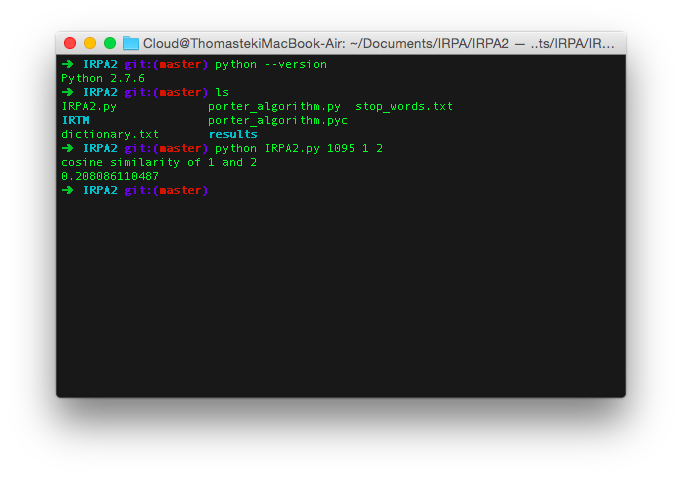

#Information Retrieval Program Assigment 2
###B00705014 資管四 徐育粮
##1. 執行環境
	Mac OS X 10.10 Yosemite with Python 2.7.6
	

##2. 設計
1. 程式執行時會讀入三個command line argument，第一個是文章數量，後兩個是要算cosine silimarity的文章編號
2. 使用for loop反覆從IRTM資料夾底下讀入文字檔，使用PA1的方法將他們tokenize，分別將原始陣列、merge好的陣列、計算出term frequency的陣列存起來
3. 將所有文件的token串接成一個大陣列，排序之後merge成dictionary輸出
4. 將每一個文件的term轉換成對應的dictionary編號並且使用之前算好的term frequency計算出每一個term的tf-idf值，並儲存成陣列
5. 計算出每個檔案所有term的distance，將tf-idf值normalized之後輸出至result資料夾，以檔案編號命名
6. 定義cos_similarity function，根據讀入的command line argument，找出剛剛算好的unit vector，進行內積並顯示在螢幕

##3. 問題與解決方案
1. Python開發經驗不足，對於list以及dictionary的使用需要查詢
2. 演算法設計需要思考效率以及記憶體使用量
3. 輸出結果龐大，很難以判斷計算的正確性，只能用肉眼大致比對

##4. 執行結果
	執行方式
	python IRPA2.py number_of_documents docID1 docID2
	EX: python IRPA2.py 1095 1 2
	//讀入1095個檔案，計算1.txt和2.txt的cosine similarity

	執行過程僅顯示兩個檔案的cosine similarity，其他無輸出，直接讀入檔案，處理後輸出至result資料夾以及dictionary.txt

